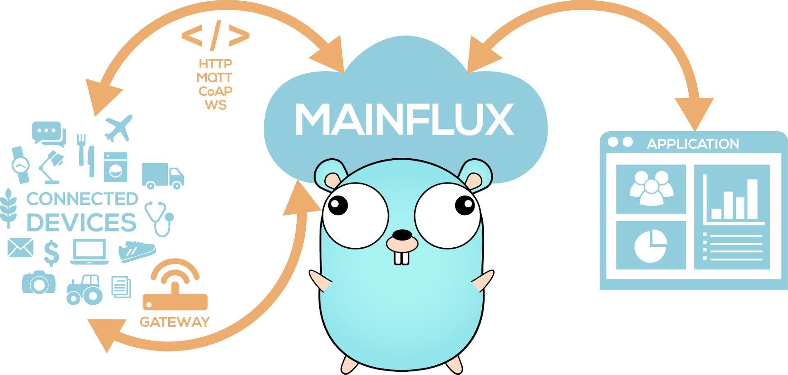
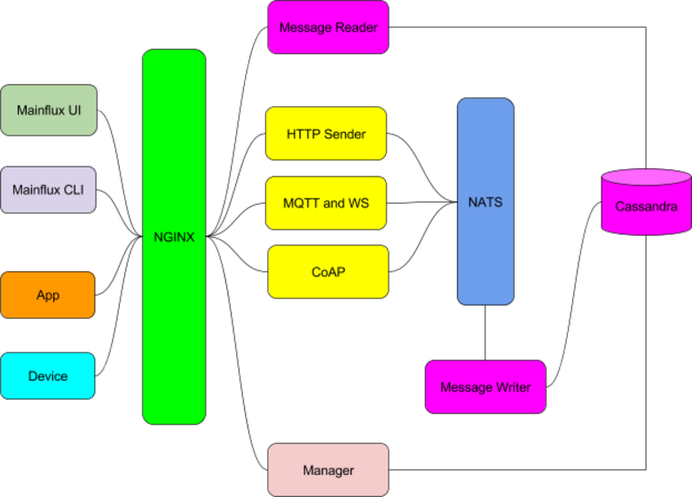

# Mainflux

## About
Mainflux is modern, highly-secured open source and patent-free IoT cloud platform written in Go, based on a set of microservices.

It allows device, user and application connections over various network protocols, like HTTP, MQTT, WebSocket and CoAP, making a seamless bridge between them. It is used as the IoT middleware for building complex IoT solutions.

More precisely, Mainflux is multi-protocol device-agnostic message relay with distributed data storage and multi-user, multi-tenant device and application management middleware.

Even more precisely Mainflux is:

- Device manager - accepts device connections on southbound interface
- Application manager - accepts application connections on northbound interface
- Messaging bridge - relays messages between devices and applications
- Distributed storage - stores and queries measurements datapoints in the multi-datacenter distributed database

We say that Mainflux is "multi-protocol" because it supports several networking protocols that proliferate in IoT world:

- HTTP
- WebSocket
- MQTT
- CoAP

We say that Mainflux is "device-agnostic" because type of device that connects to it is completely transparent to
Mainflux due it's generic internal device model (representation).
That means that you can connect absolutely every device to Mainflux

Mainflux is built with <3 by [Mainflux Company](http://mainflux.com) and community contributors.

## Architecture
Mainflux IoT cloud is composed of several components, i.e. microservices:

| Link          | Description           |
|:--------------|:----------------------|
| [manager](https://github.com/mainflux/mainflux/tree/master/manager) | Service for managing platform resources, including auth |
| [http-adapter](https://github.com/mainflux/mainflux/tree/master/http) | HTTP message API server |
| [mqtt-adapter](https://github.com/mainflux/mqtt-adapter) | MQTT PUB/SUB Broker (with WebSocket support) |
| [coap-adapter](https://github.com/mainflux/mainflux/tree/master/coap) | CoAP message API server |
| [message-writer](https://github.com/mainflux/mainflux/tree/master/writer) | Worker behind NATS that writes messages into Cassandra DB |
| [dashflux](https://github.com/mainflux/dashflux) | System Dashboard in Angular 2 Material |
| [bashflux](https://github.com/mainflux/bashflux) | Interactive command-line interface |
| [Cassandra](https://github.com/apache/cassandra) | System Database |
| [NATS](https://github.com/nats-io/gnatsd) | System event bus |
| [NGINX](https://github.com/nginx/nginx) | Reverse Proxy with Auth forwarding |

Docker composition that constitues Mainflux IoT infrastructure is defined in the [`docker-compose.yml`](https://github.com/Mainflux/mainflux/blob/master/docker-compose.yml).

## Features
An extensive (and incomplete) list of features includes:

- Responsive and scalable architecture based on a set of [microservices](https://en.wikipedia.org/wiki/Microservices)
- Set of clean APIs: HTTP RESTful, MQTT, WebSocket and CoAP
- SDK - set of client libraries for many HW platforms in several programming languages: C/C++, JavaScript, Go and Python
- Device management and provisioning and OTA FW updates
- Highly secured connections via TLS and DTLS
- Enhanced and fine-grained security with Access Control Lists
- Easy deployment and high system scalability via [Docker](https://www.docker.com/) images
- Clear project roadmap, extensive development ecosystem and highly skilled developer community
- And many more

## Authors
Main architect and BDFL of Mainflux project is [@drasko](https://github.com/drasko). Additionaly, initial version of Mainflux was architectured and crafted by [@janko-isidorovic](https://github.com/janko-isidorovic), [@nmarcetic](https://github.com/nmarcetic) and [@mijicd](https://github.com/mijicd).

